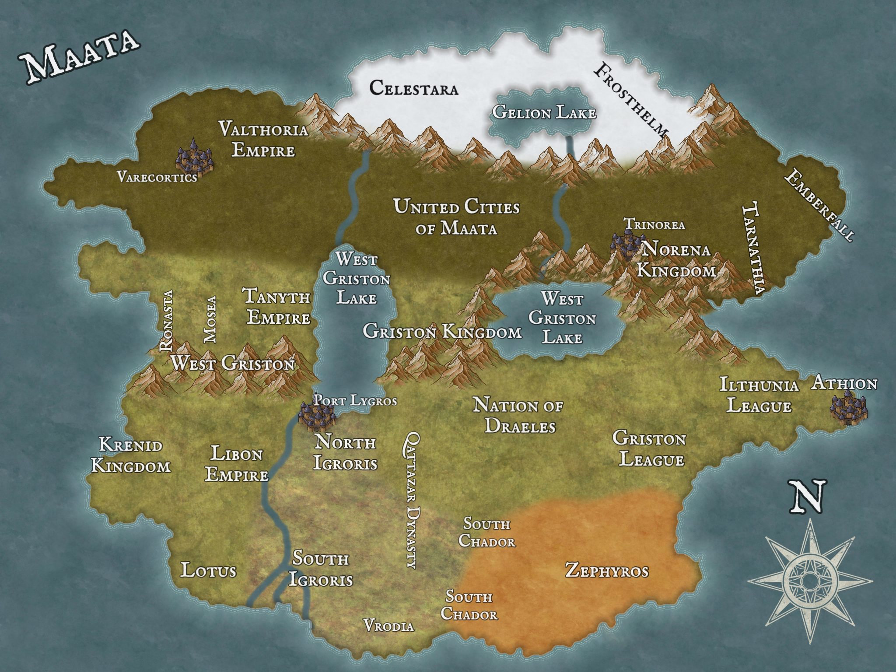

# Maata
Welcome to the Maata universe. This is a world I am building for my Home-brewed campaign. This contains world notes, campaign diaries, etc.

## [Countries](countries/home.html)

- [Ilthunia League](countries/ilthunia-league.html)

### Cities Quick Link
- [Wind Hills](countries/cities/wind-hills.html)

## Races
- Humans
- Elves
- Dwarves

## Religion
Maata's world has a completely custom system of dieties. 

[Overview](religion/home.html)

## NPCs
List of NPC's, organized by country then city.
*Note, will probably change*

[Overview](npc/home.html)

## Organizations
Continental organizations, with a few additional ones.

[Overview](Organizations/home.html)
