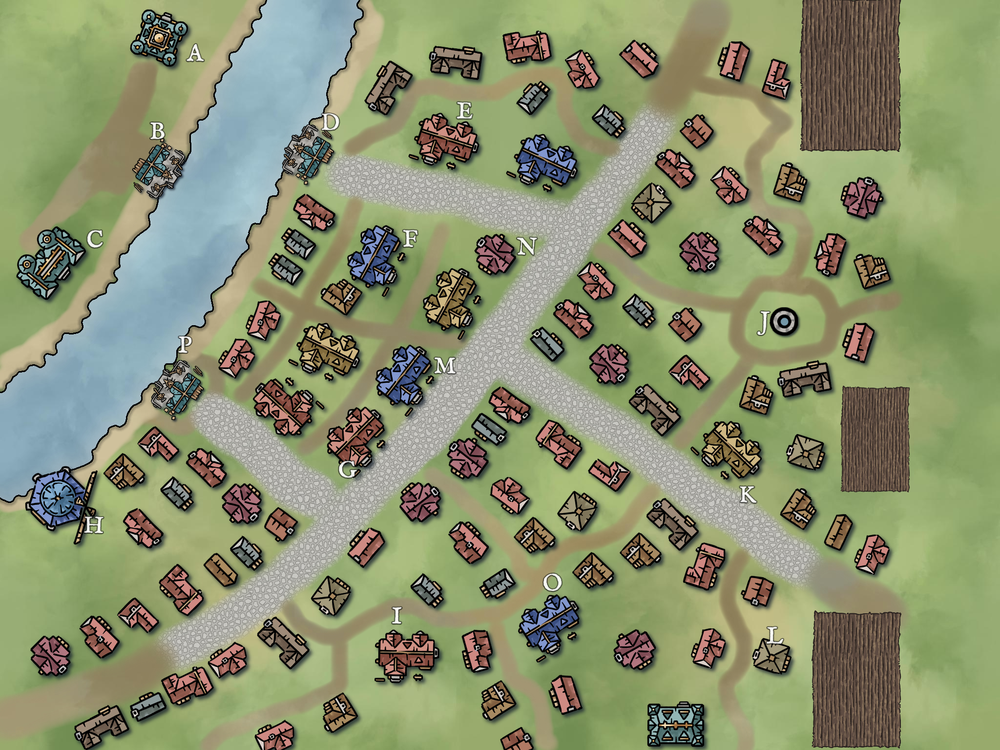

# Wind Hills
*[Ilthunia League](../ilthunia-league.html)*

## Map Key

### A: Lady Boyle's House  
The stately home of Lady Boyle, matriarch of the influential Boyle family, known for hosting lavish gatherings and guiding city affairs.

### B: Boyle Shipyard  
A bustling shipyard operated by the Boyle family, where skilled workers repair sturdy vessels for trade and travel along the rivers.

### C: Sargent Smith  
The residence and office of Sargent Smith, Wind Hills’ respected city guard captain, always vigilant in keeping the peace. Sargent Smith was a powerful leader in war and started sucessful businesses off it spoil.

### D: Dockyard of Kymion  
A dockyard that loads and unloads trading ships. This yard sacrafices the first fruits to Kymion. 

### E: The Gaggling Goose  
A lively tavern popular among locals and travelers, renowned for its hearty stews and evening entertainment.

### F: Jermey's Bakery  
A cozy bakery run by Jermey, whose fresh breads and sweet pastries are a daily delight for the townsfolk.

### G: Carpenter  
The workshop of Wind Hills’ master carpenter, supplying fine furniture and repairs to homes and ships alike.

### H: Talitha's Mill  
Talitha’s water-powered mill grinds grain for the city, its rhythmic turning a familiar sound on the breeze.

### I: City Jail  
A sturdy stone building where lawbreakers are held, overseen by the city guard and known for its strict discipline.

### J: Sir Norton Boyle the Third's Well  
A historic well named after Norton Boyle who used his great wealth to revitalize the town many moons ago. Some in the town drink of its water, hoping to gain riches like those of Sir Norton Boyle.

### K: City Hall  
The administrative heart of Wind Hills, where council meetings and important decisions shape the city’s future.

### L: Order of Lahakhshil's Blacksmith  
A forge run by members of the Order of Lahakhshil, producing weapons and tools imbued with their unique craftsmanship.

### M: Herbert's Blacksmith  
Herbert’s independent smithy, known for reliable repairs and custom metalwork for locals and sailors.

### N: Lyris's Temple  
A serene temple dedicated to Lyris, offering guidance and blessings to those seeking wisdom and peace. This temple offers a lot of the entertainment during the town's annual festivals. 

### O: Temple of Sitàri  
A vibrant place of worship for Sitàri, where festivals and rituals celebrate the deity’s ability to grow and tend crops.

### P: Shipyard of the Wind Hills Saints  
A prestigious shipyard operated by the Wind Hills Saints, famed for constructing legendary ships that sail far and wide.
