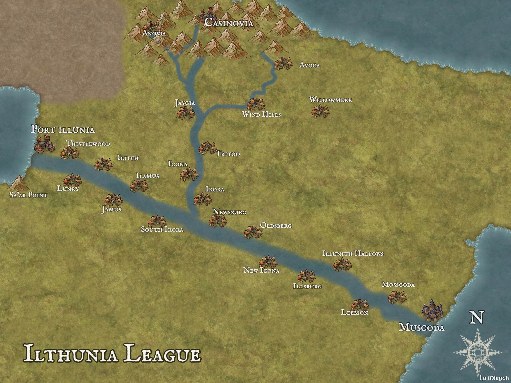

# Ilthunia League

*Capital: Muscoda*

*Notable City: Port Illunia*

## Description

The Ilthunia League sprawls across a region of gentle rolling hills and vast, wind-swept grasslands, bordered by a glittering coastline that stretches for miles. The land is dotted with independent city-states, each with its own customs and governance, yet united under the banner of the League. The capital, Muscoda, sits at the ocean edge of the territory, renowned for its grand council halls and vibrant markets. To the west, the bustling port city of Port Illunia serves as the gateway to the Eastern Griston Lake, its harbors filled with goods from the heart of the continent. The countryside is rich with wildflowers, ancient standing stones, and winding rivers, offering both beauty and mystery to travelers and adventurers alike.

There is a strong sense of individual autonomy for those who inhabit the lands. This region is mainly dominated by fair-skinned humans, although creatures from all walks of life inhabit these lands. Ilthunians aren't nosey and this provides a high incentive for those looking to escape their past to create a new life for themselves.

## History of the Name "Ilthunia"

Long ago, the region was known as the "Thunian Plains," named after the ancient Thunian tribes who first settled the fertile hills. As the city-states grew and trade flourished along the coast, a legendary leader named Ilra united the tribes in a pact of peace and cooperation. In honor of Ilra and the Thunian heritage, the new alliance was called the "Ilthunia League"—a name blending Ilra’s legacy with the land’s original title. Over centuries, Ilthunia became synonymous with unity, resilience, and the promise of prosperity for all its people.

The Athions to the east seperated from the Ilthunia League 200 years ago. The Athions started as a small port city along the coast but quickly rose to prominance due to the particularly rich soil and whaling industry in the area. The Athions were tired of being under the thumb Muscoda and rebelled. This led to a bloody war between Athions and Muscoda. Even 200 years later, there still exists rememberance ceremonies in honor of the soilders who sacraficed themselves.

## Country Relations

The Ilthunia League maintains decent relations to the Griston League to the south, sharing a common ancestry and culture. 

The [Athions](athion.html) maintain tense relations with Ilthunia. There exists political factions amongst Muscoda that wish to recapture the wealth of Athions and the Athions are well aware of their intentions.

The Norena Kingdom to the north currently maintains stable relations with Ilthunians. However, there are significant cultural difference which hampers relations.

